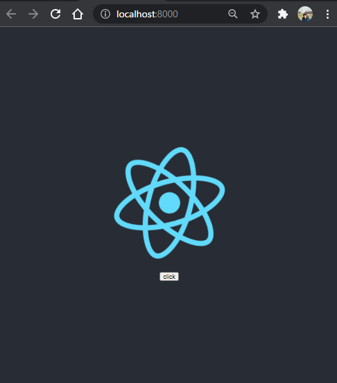
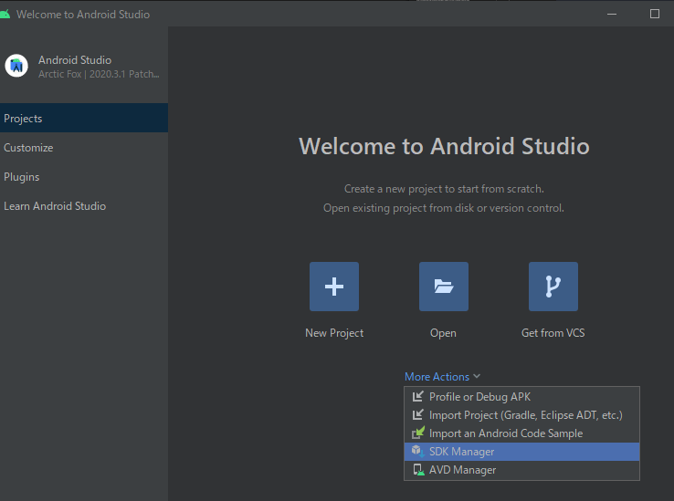
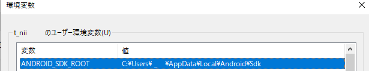
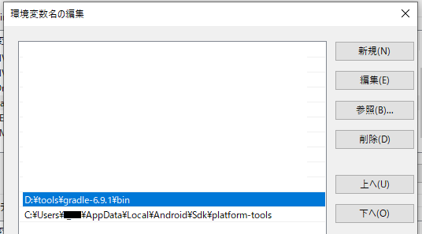
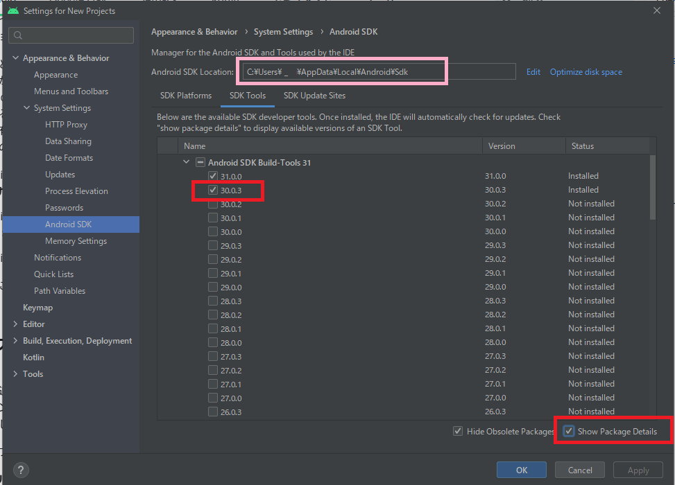
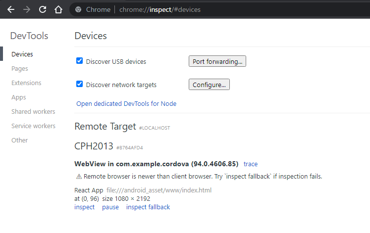
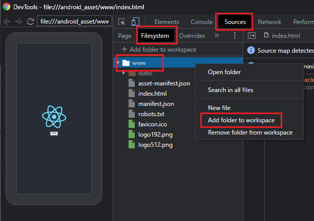
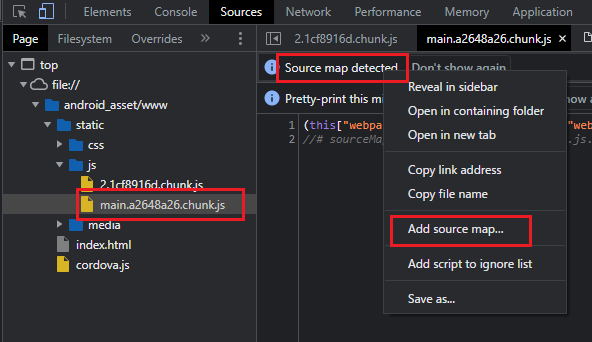
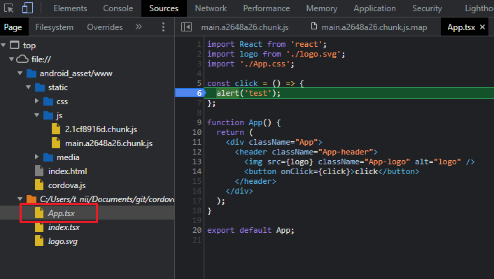
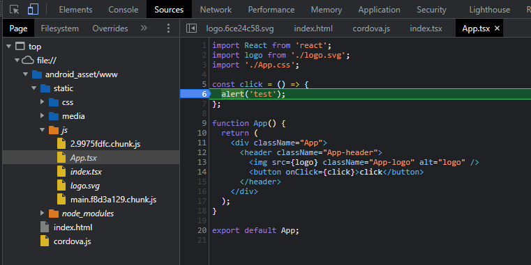

# Create React App(TypeScript) & Cordovaでアプリをつくる(2021年10月版)

下記ページを参考に、2021年10月時点のCreate React Appで環境作成する手順を記載します。
https://qiita.com/bathtimefish/items/113154e89650b351b5b7

実機デバッグのやり方までたどりつくのに、かなり試行錯誤が必要でした。

作成ソース
https://github.com/murasuke/cordova-react-typescript-template

## 概要手順
* ①cordova環境でreact動作確認(ブラウザ)
  1. react用プロジェクトと、cordova用プロジェクトを作成する
  1. cordova用フォルダから、config.xmlをreact用フォルダにコピーする
  1. reactのビルドフォルダを「build」⇒「www」に変更する
  1. reactの「public/index.html」ファイルに3行&lt;meta&gt;タグをと`cordova.js`の読み込み追加する
  1. reactの「src/index.ts」を変更する。
  1. reactをビルドしてから、`cordova run browser`で実行する
* ②android用モジュールのビルド
  1. Android Studioのインストール
  1. Gradle(ビルド自動化システム)のインストール
  1. ビルドエラーの対処① (メモリ不足エラー)
  1. ビルドエラーの対処② (SDK Build-tool に不足しているファイルへの対処)
  1. ビルドが正常終了することを確認
* ③Android実機での実行
  1. Android端末の「USBデバッグ」を有効にする
  1. USBでAndroid端末を接続する
  1. 接続したAndroid端末が、cordova側から認識されていることを確認
  1. 実機でアプリを実行する
* ④Androidでデバッグ実行 (soucemapを手動読み込み)
  1. 実機でアプリを実行する
  1. PCのChromeからリモートデバッグを行う
  1. TypeScriptソースでデバッグを可能にするためsourcemapを追加
* ⑤create-react-appのビルド設定を変更('inline-source-map')し、sourcemapの手動読み込みを不要にする
  1. package.jsonの`devDependencies`に`rewire`を追加
  1. package.jsonの`scripts`に、ビルド用スクリプトを追加
  1. プロジェクト直下に`build.js`を作成し、ビルド設定を上書きする

<p style="color:hotpink;">Emulatorでの確認はしていません。ディスク空き容量の関係で構築できなかったためです</p>

## 手順(①cordova環境でreactを動作させる)

### react用プロジェクトと、cordova用プロジェクトを作成する

cordovaをグローバルインストールします(ローカルインストールだと動きません)
```bash
npm install -g cordova
```

craでreactアプリを作成する
```bash
npx create-react-app hello-cordova-react --template typescript --use-npm
```

Cordova プロジェクトを作成する
```
cordova create hello-cordova com.example.cordova hello-cordova
```

  * `hello-cordova-react`フォルダと、`hello-cordova`フォルダが同一フォルダに入っている状態

### cordova用フォルダから、config.xmlをreact用フォルダにコピーする

hello-cordova/config.xml を hello-cordova-react 下にコピーする
```
cp ./hello-cordova/config.xml ./hello-cordova-react/
```

### reactのビルドフォルダを「build」⇒「www」に変更する

https://stackoverflow.com/questions/41495658/use-custom-build-output-folder-when-using-create-react-app

windows用(cmd)の記載方法です。(gitbashを利用している場合も内部コマンドはcmd.exeのため、この書き方です)
* `&&`の前後にスペースを入れないこと。スペースを含む不正なパスになり、エクスプローラーから削除できなくなります。
```json
  "scripts": {
    "build": "set BUILD_PATH=www&&react-scripts build",
  }
```
windows以外の場合は、下記の通りだと思いますが未検証です。
```json
  "scripts": {
    "build": "BUILD_PATH='./www' react-scripts build",
  }
```

package.jsonに下記を追加

```
  "homepage": ".",
```

### reactの「public/index.html」ファイルに3行&lt;meta&gt;タグをと`cordova.js`の読み込み追加する

`public/index.html` の &lt;head&gt;内に下記を追加する。
```
  <meta http-equiv="Content-Security-Policy" content="default-src * 'unsafe-inline' 'unsafe-eval'; style-src 'self' 'unsafe-inline'; media-src *; img-src * data: content:;">
  <meta name="format-detection" content="telephone=no">
  <meta name="msapplication-tap-highlight" content="no">
```

&lt;/body&gt;の直後の下記を追加
```
  <script type="text/javascript" src="cordova.js"></script>
```

修正後の`public/index.html`(長くなるためコメントは消してあります)
```html
<!DOCTYPE html>
<html lang="en">
  <head>
    <meta charset="utf-8" />
    <link rel="icon" href="%PUBLIC_URL%/favicon.ico" />
    <meta name="viewport" content="width=device-width, initial-scale=1" />
    <meta name="theme-color" content="#000000" />
    <meta name="description" content="Web site created using create-react-app" />
    <meta http-equiv="Content-Security-Policy" content="default-src * 'unsafe-inline' 'unsafe-eval'; style-src 'self' 'unsafe-inline'; media-src *; img-src * data: content:;">
    <meta name="format-detection" content="telephone=no">
    <meta name="msapplication-tap-highlight" content="no">
    <link rel="apple-touch-icon" href="%PUBLIC_URL%/logo192.png" />

    <link rel="manifest" href="%PUBLIC_URL%/manifest.json" />

    <title>React App</title>
  </head>
  <body>
    <noscript>You need to enable JavaScript to run this app.</noscript>
    <div id="root"></div>
  </body>
  <script type="text/javascript" src="cordova.js"></script>
</html>
```

`src/index.tsx` を開いて以下のように編集する

変更前
```tsx
ReactDOM.render(
  <React.StrictMode>
    <App />
  </React.StrictMode>,
  document.getElementById('root')
);
```

変更後
```tsx
const startApp = () => {
  ReactDOM.render(
    <React.StrictMode>
      <App />
    </React.StrictMode>,
    document.getElementById("root")
  );
};

if ((window as any).cordova) {
  document.addEventListener("deviceready", startApp, false);
} else {
  startApp();
}
```

後ほどのデバッグ用に、`src/App.tsx` を開いてボタンを追加する。
```tsx
import React from 'react';
import logo from './logo.svg';
import './App.css';

const click = () => {
  alert('test');
};

function App() {
  return (
    <div className="App">
      <header className="App-header">
        
        <button onClick={click}>click</button>
      </header>
    </div>
  );
}

export default App;
```
### reactをビルドしてから、`cordova run browser`で実行する

reactをビルドする(`www`フォルダに配置されます)
```bash
npm run build
```

プラットフォームを追加
```bash
cordova platforms add browser
cordova platforms add android
```

cordovaプロジェクトを実行
```bash
cordova run browser
```

localhost:8000でReactアプリが開きます。




---
## ②android実機で動作確認


### [android studio](https://developer.android.com/studio?hl=ja) のインストール

([インストール手順](https://developer.android.com/studio/install?hl=ja))

  SDKのインストールパスを確認するため`Android Studio`を起動します。

  

  `SDK Manager`を選択します。下記画面の赤枠内にSDKのインストールパスが表示されています。

  


  SDKのパスを環境変数に設定します。

  

### [Gracle(ビルド自動化システム)](https://gradle.org/install/)のインストール

ダウンロード後、任意のフォルダに解凍して、Gradleのbinフォルダのパスを環境変数`path`に追加します。

  

  sdkの'platform-tools'のパスも追加します。

* Andoroid向けにビルドを行う (失敗します・・・)

```
cordova build android
```
### ビルドエラーの対処① (メモリ不足エラー)

  (環境依存かもしれません。エラーがなければ次へ進んでください)

```
$ cordova build android
Checking Java JDK and Android SDK versions
ANDROID_SDK_ROOT=C:\Users\t_nii\AppData\Local\Android\Sdk (recommended setting)
ANDROID_HOME=undefined (DEPRECATED)
Using Android SDK: C:\Users\t_nii\AppData\Local\Android\Sdk
Starting a Gradle Daemon (subsequent builds will be faster)

FAILURE: Build failed with an exception.

* What went wrong:
Unable to start the daemon process.
This problem might be caused by incorrect configuration of the daemon.
For example, an unrecognized jvm option is used.
Please refer to the User Manual chapter on the daemon at https://docs.gradle.org/6.9.1/userguide/gradle_daemon.html
Process command line: C:\Program Files (x86)\Java\jdk1.8.0_181\bin\java.exe -Xmx2048m -Dfile.encoding=windows-31j -Duser.country=JP -Duser.language=ja -Duser.variant -cp D:\tools\gradle-6.9.1\lib\gradle-launcher-6.9.1.jar org.gradle.launcher.daemon.bootstrap.GradleDaemon 6.9.1
Please read the following process output to find out more:
-----------------------
Error occurred during initialization of VM
Could not reserve enough space for 2097152KB object heap
```

2GBのメモリが確保できないというエラー(OSの空きメモリは6GBあっても失敗した)

下記ページを参考に、起動時に確保するメモリを1GBに変更します。

  [cordovaを使用してのビルド時にデーモンプロセスエラーが発生する](https://forum.tkool.jp/index.php?threads/%E3%80%90%E8%A7%A3%E6%B1%BA%E6%B8%88%E3%80%91cordova%E3%82%92%E4%BD%BF%E7%94%A8%E3%81%97%E3%81%A6%E3%81%AE%E3%83%93%E3%83%AB%E3%83%89%E6%99%82%E3%81%AB%E3%83%87%E3%83%BC%E3%83%A2%E3%83%B3%E3%83%97%E3%83%AD%E3%82%BB%E3%82%B9%E3%82%A8%E3%83%A9%E3%83%BC%E3%81%8C%E7%99%BA%E7%94%9F%E3%81%99%E3%82%8B%E3%80%90androidstudio%E5%88%A9%E7%94%A8%E3%80%91.4505/)

  [cordova-could-not-reserve-enough-space-for-2097152kb-object-heap](https://stackoverflow.com/questions/41216921/cordova-could-not-reserve-enough-space-for-2097152kb-object-heap)


* 対応方法 - reactのプロジェクトにある`Gradle`のビルド設定ファイルを修正します。
<app path>\platforms\android\cordova\lib\config\GradlePropertiesParser.js

変更前
```
// to allow dex in process
'org.gradle.jvmargs': '-Xmx2048m',
```
変更後
```
// to allow dex in process
'org.gradle.jvmargs': '-Xmx1024m',
```


### ビルドエラーの対処② (SDK Build-tool に不足しているファイルへの対処)

メモリ不足解消後、下記のエラーが発生します。
```
FAILURE: Build failed with an exception.

* What went wrong:
Could not determine the dependencies of task ':app:compileDebugJavaWithJavac'.
> Installed Build Tools revision 31.0.0 is corrupted. Remove and install again using the SDK Manager.
```

Android studioの最新版(31)から、cordovaのビルドができなくなっています。
cordovaは、下記2ファイルが存在する前提でビルドを行おうとしますが、Ver31にはファイルがありません。
```
<Andorid SDK path>/build-tools/31.0.0
<Andorid SDK path>/build-tools/31.0.0/lib/
```


* 対応方法 - SDK Build-tool 30を導入し、必要なファイルをコピーする


Android studio の SDK ManagerのSDK Toolsから「Android SDK Build-tool 30.0.3」を導入
  * `Show Package Details`をチェック
  * バージョン一覧が表示されるので、`30.0.X`を選択して追加する

  


不足しているファイルをコピーします。`Andorid SDK path`は、上記の図のピンクで囲った部分です。

コピー元

```
<Andorid SDK path>/build-tools/30.0.3/dx
<Andorid SDK path>/build-tools/30.0.3/lib/dx.jar
```

コピー先

```
<Andorid SDK path>/build-tools/31.0.0
<Andorid SDK path>/build-tools/31.0.0/lib/
```

### ビルドが正常終了することを確認

やっとビルドが通るようになります。
```
cordova build android
```
## ③Android実機での実行

### Android端末の「USBデバッグ」を有効にする

  https://developer.android.com/studio/debug/dev-options?hl=ja

### Android端末とPCをUSBで接続する

### 接続したAndroid端末が、cordova側から認識されていることを確認する

```
$ cordova run --list
Available android devices:
b764afd4
Available android virtual devices:
Android_Accelerated_x86_Oreo
pixel_2_pie_9_0_-_api_28
```
`Available android devices:`の直下に表示されていれば認識されています。

### 実機でアプリを実行する

```
$ cordova run android --target=b764afd4
```
`--target=`の後ろに、認識されたデバイスのIDを指定して実行します。

## ④Androidでアプリをデバッグ実行 (soucemapを手動読み込み)

USBで接続しておく
###  実機でアプリを実行する

下記コマンドで接続されているAndroid端末を確認する
```
$ cordova run --list
```

Android端末で実行する
```
$ cordova run android --target=b764afd4
```

## PCのChromeからリモートデバッグを行う

PCのChromeからリモートデバッグを行うため、DevToolsのDeviceを開きます。

```
chrome://inspect/#devices
```

  

  Remote Targetに「WebView in 【アプリ名】」と表示されます

  `inspect`をクリックして、リモートデバッグを開始します。

  * この時点ではsourcemapが読み込まれないため、TypeScriptソースでのデバッグができません。(コンパイル後jsソースでしかデバッグができない)

## TypeScriptソースでデバッグを可能にするためsourcemapを追加

  * このような場合、DevToolにsourcemapを読み込ませることで、デバッグを行うことができます。

  1. 「Source」タブ⇒「FileSystem」の「Add folder to workspace」で、ローカルPCの「www」(reactのビルドファイル保存フォルダ)を選択(～.js.map というファイル名がsourcemapです)

  

  `main～.js.map`ファイルを選択して`Copy link address`をクリック

  

  2. 次に「Page」タブを開き、「Source map detected」というメッセージを右クリックして、ソースマップを追加する

  

  3. DevToolにTypeScriptソースが追加され、デバッグできるようになる

    スマホ側で`click`ボタンを押すと、ブレークポイント(6行目)で止まります。

  

  <p style="color:hotpink;font-size:16px">
  毎回sourcemapを指定するのは大変なため、reactのビルド設定を見直して、sourcemapをinline化します</p>


## create-react-appのビルド設定を変更('inline-source-map')し、sourcemapの手動読み込みを不要にする

[rewire](https://github.com/jhnns/rewire) を使うと、eject無しでwebpackのビルド設定を上書きできます。


production buildを行う際、source mapを`inline-source-map`(jsソース自体に埋め込む)設定にします。

### package.jsonの`devDependencies`に`rewire`を追加

```sh
  npm i -D rewire
```

### package.jsonの`scripts`に、ビルド用スクリプトを追加

```json
"build-inlinemap": "set BUILD_PATH=www&&node ./build.js",
```

### プロジェクト直下に`build.js`を作成し、ビルド設定を上書きする

```javascript
const rewire = require('rewire');
const defaults = rewire('react-scripts/scripts/build.js');
const config = defaults.__get__('config');

config.devtool = 'inline-source-map';
```

ビルドスクリプトから`config`オブジェクトを取り出して、`devtool`プロパティーを`inline-source-map`に変更します。(変更前は`cheap-module-source-map`がセットされています)

### ビルドを行い結果を確認

```
npm run build-inlinemap
cordova run android --target=b764afd4
```

* sourcemapがinline(.jsファイルに含む)化されたため、TypeScriptソースでのデバッグが可能になります

  


## おまけ

`Error: No Java files found which extend CordovaActivity.`
というエラーが発生した場合の対処方法

```
cordova platform rm android
cordova platform add android
```
  * config.xml を変更した場合に起きるようです。その場合、上記のコマンドでなおります。
